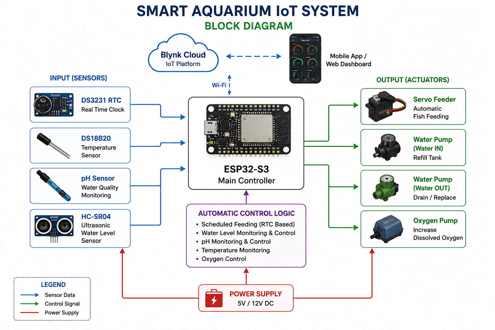

# Smart Aquarium Monitoring & Automation System

---

## Project Overview

An ESP32-S3 based Smart Aquarium Monitoring and Automation System designed to automate aquarium maintenance and enable real-time IoT monitoring using the Blynk Cloud platform.

---

## Features

- Automatic Fish Feeding
- Temperature Monitoring
- pH Monitoring
- Water Level Monitoring
- Automatic Water Replacement
- Oxygen Pump Control
- Real Time Clock (RTC)
- WiFi IoT Monitoring
- Manual & Automatic Operation

---

## Hardware

- ESP32-S3
- DS3231 RTC
- DS18B20 Temperature Sensor
- pH Sensor
- HC-SR04 Ultrasonic Sensor
- Servo Motor
- Relay Module
- Water Pump
- Oxygen Pump

---

## Software

- Arduino IDE
- Embedded C++
- Blynk IoT
- ESP32 Libraries

---

## Dashboard

---

## Block Diagram

---

## Circuit Diagram

---

## Prototype

---

## Future Improvements

- PCB Design
- Mobile Application
- AI Based Fish Feeding
- Water Quality Prediction
- Cloud Data Logging

---

## Author

**Ruhit Mondal**

Department of EEE

Ahsanullah University of Science and Technology

Bangladesh
